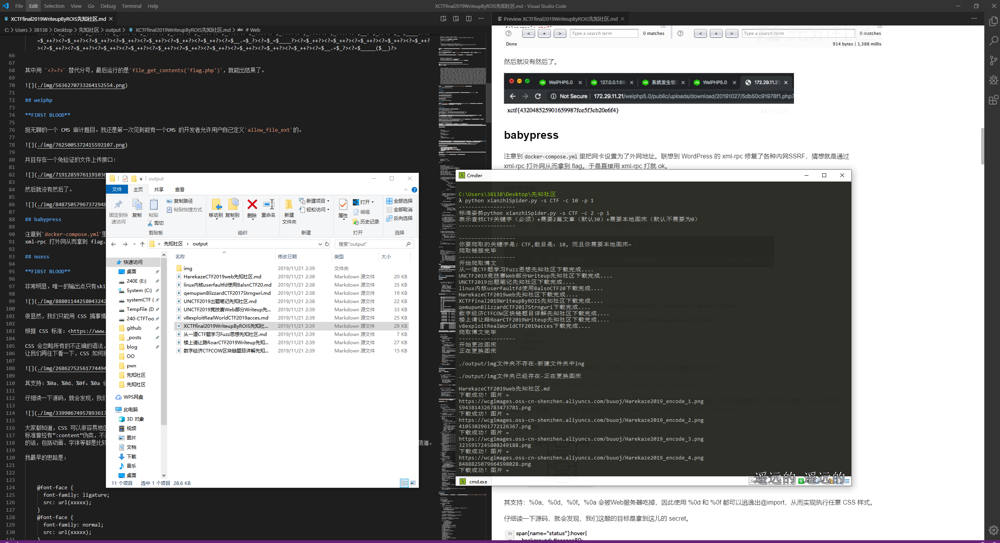
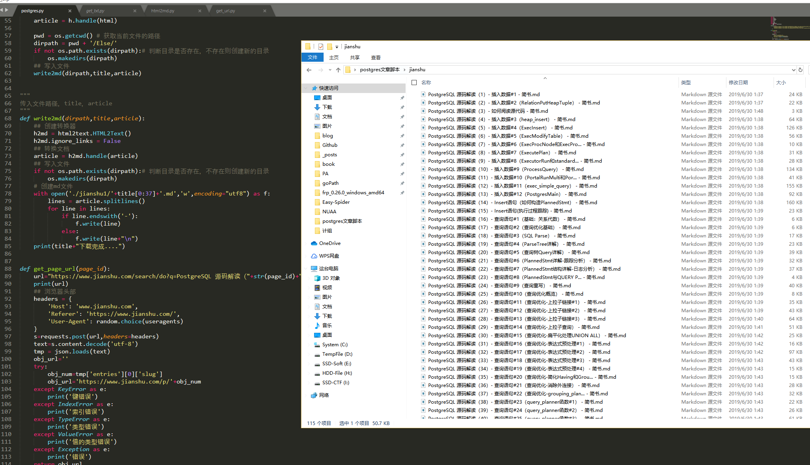

### Get markdown from csdn/知乎/简书/segmentfault
##### 1、html_to_markdown.py
Get Markdown by csdn/知乎/简书/segmentfault url 
```
python3 html_to_markdown.py -u <url> 
```
for example
```
python3 html_to_markdown.py -u https://blog.csdn.net/like98k/article/details/80261603
```

###### 2、do_search.py
Use the Search Function for jianshu-Change to line 89
for example-search "Postgres源码解读" 


#####（仅供学习，禁止商用-互联网并非法外之地