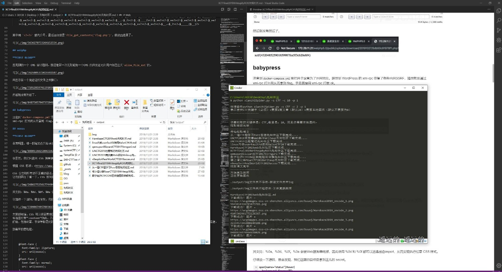

## 本项目停止更新，因为接口换了脚本暂时不能用，需要请移步天河大佬的版本
感谢天河大佬维护，船新版本  https://github.com/qiannianshuangxue/safe_message_spider

### 基于python3 将先知/简书的博客通过关键字爬取到本地转为markdown格式，并建立本地图床

目前只支持简书和先知社区
### 参数说明

- -s 需要查找的关键字，空代表按时间顺序爬取
- -c 需要文章的数目，默认30
- -p 是否需要建立本地图床，默认0 0代表不需要 1代表需要

### 先知社区 2021-6月更新

xz增加了反爬，没得时间逆向了，手动访问一次https://xz.aliyun.com/，更新第38行的acw_sc__v2字段即可
```bash
https://github.com/bkfish/html2markdown_Spider
cd xianzhiSpider
pip install -r requirements.txt
python xianzhiSpider.py -s CTF -c 10 -p 1
```
生成的内容放于同目录./xianzhi文件夹下，先知目前文章总数为五千不到，建议-c最大开至5000
### 简书
简书由于多次访问会ban，所以慢一些，但是不影响使用~多等等
```bash
git clone https://github.com/Kit4y/xianzhiSpider
cd xianzhiSpider
pip install -r requirements.txt
python jianshuSpider.py -s CTF -c 5 -p 1
```
生成的内容放于同目录./jianshu文件夹下，因为简书最多只能100页每页10篇文章 所以-c最大开至1000


### !! 第二次使用请删除文件夹内的img子文件夹，建议将整个jianshu/xianzhi文件夹转移位置再进行下一次爬取



仅供学习，禁止商用行为